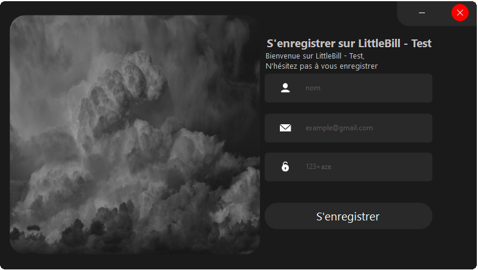

# Little Bill - Test by Pierre DUVEAU

## Introduction
La start-up Little Bill m'a demandé de réaliser une solution, en utilisant les technologies que je souhaitais à 2 conditions :
- avoir une API REST
- que ca soit fonctionnel


## Sommaire

- Choix des technologies

- Informations complémentaires

- [Maquette du front (sur Figma)](https://www.figma.com/file/PwBOqkqrcHoYId855DBIr7/Little-Bill-Dev-Test)

- Contenu du .zip

- Comment utiliser la solution

- Lien Youtube au cas où


## Screenshots

#### Login

#### Register

#### Application


### Choix des technologies

Comme précisé lors de mon entretien avec FX, j'ai commencé à apprendre à programmer avec le C#.

Au vu du temps limité dont je dispose, je ne voulais pas m'handicaper d'avantage en choisissant une nouvelle technologie que je ne maitrise pas.

- Le backend, réalisé en C# ASP.NET Core 5.0
- Le frontend, réalisé en C# Winform 4.7.X
- La base de données est en SQL gérée avec SSMS
- Design de l'application réalisé avec Figma

### Informations complémentaires

Toutes les requêtes ont été testés avec l'outils de requêtes **Postman**

Toutes les requêtes sont fonctionnelles, cependant je n'ai pas réussi à finir la réinitialisation de mot de passes.

C'est la première fois que je faisais de l'authentification avec JWT, donc si jamais il y a des énormités  veuillez m'en excuser.

C'est également la première fois que je réalisais un backend en ASP.NET.

Pour la gestion de l'historique, j'ai fais le choix de le stocker en local dans un `fichier.json` qui est récupéré au lancement et ré-écrit à la fermeture de l'application.

### Contenu du .zip

Dans le .zip vous trouverez : 
- le build du frontend
- le build du backend
- un dump de la bdd

### Comment utiliser la solution

1. Créer la bdd via le dump fourni avec l'application
2. modifier les informations de connexion dans le fichier appSettings.json du backend

```json
  "AppSettings": {
    "Secret": "little-bill-backend-secret",
    "ResetMailSecret": "little-bill-reset",
    "Mail": "adresse@gmail.com", // voir ci dessous 
    "Password": "mdp" // voir ci dessous
  },  // le reset du mdp ne fonctionne pas car Gmail bloque l'application
  "ConnectionStrings": {
    "LittleBillDb": "SERVER=DESKTOP-MRTR1UE;Database=LittleBillDb;Trusted_Connection=True;" 
  }, // modifier la chaine de connexion pour pouvoir utiliser la bdd
```
3. Lancez le backend : `LittleBill-test-backend.exe`
4. Lancez le frontend : `LittleBill-test-frontend.exe`
5. Testez

### Lien Youtube

Afin d'éviter l'effet 'Démo' (rien ne marche quand quelqu'un d'autre que nous teste la solution)

Voici un lien youtube : [cliquez ici](https://youtu.be/fTmPEnyz0SA)
